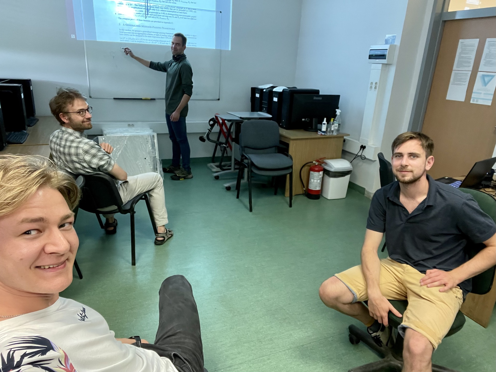

## KASK Reading Group 

📚 KASK Reading Group is a research organisation of PhD students interested in neural networks.
🧐 We are collaboratively reading and discussing advances in the area. 

We meet fortnightly on Wednesdays at 5 PM. 
Our first meeting was at 06.07.2022.

## Presentations:
- [ ] [24.08.2022] Jan Wasilewski: [Bayesian NN]()
- [ ] [27.07.2022] Szymon Olewniczak: [Scalable Zero-shot Entity Linking with Dense Entity Retrieval](https://arxiv.org/abs/1911.03814)
- [x] [20.07.2022] Stanislaw Baranski: [Oblivious Neural Network Predictions via MiniONN transformations](https://eprint.iacr.org/2017/452.pdf)
- [x] [06.07.2022] Robert Benke: [A New Perspective on "How Graph Neural Networks Go Beyond Weisfeiler-Lehman?"](https://openreview.net/pdf?id=uxgg9o7bI_3)

## We

